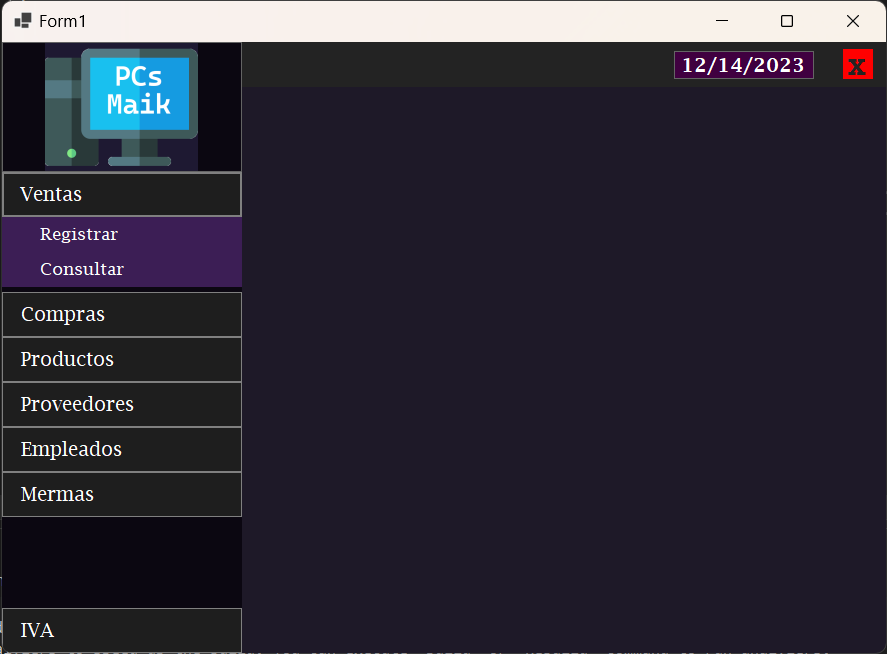

## CRUD operations in MVC architecture

This system was developed for the use case of a PC components store called: *"PC Componentes Maik"*  

The database uses PostgreSQL, the system connects to it through the **localhost**, modify the line 17 from [Form1.cs](https://github.com/Rafa-X/CRUD-operations-in-MVC-architecture/blob/main/Form1.cs#L17) to adapt your database connection.

  

## Requeriments
- Download the database backup [DatabaseBK](https://github.com/Rafa-X/CRUD-operations-in-MVC-architecture/blob/main/pcs_maik_bk-plain.sql) and restore it in PostgreSQL
- Modify the database connection in the WindowsForm [Form1.cs](https://github.com/Rafa-X/CRUD-operations-in-MVC-architecture/blob/main/Form1.cs) if neccesary (Host, Username, Password)

## Guide of Use
### Venta (Sales > Client)
  - Registrar
    - Enter the ID of the product and press ENTER to consult
    - Enter the amount of the product to sell and press ENTER, this will add the product to a shopping cart
    - Press the green button "Registrar" to add the new Sale
    - *`To remove a product, enter the its ID on the ID field and press the red button "Remover Producto"`*
  - Consultar
    - Enter the ID of the Sale and press ENTER to consult
      
### Compras (Purchases > Providers)
  - Registrar
    - Enter the ID of the product and press ENTER to consult
    - *`If its a new product, write a "X" in the ID field`*  
      *`Enter the name in the Product field`*  
      *`Enter the max-stock that will be allowed to have in store in the second field of Stock`*
    - Enter the ID of the provider in its field and press ENTER
    - Enter the amount of the product to buy and press ENTER, this will add the product to a shopping cart
    - Press the green button "Registrar" to add the new Purchase
    - `*To remove a product, enter the its ID on the ID field and press the red button "Remover Producto"*`
  - Consultar
    - Enter the ID of the Purchase and press ENTER to consult
    
### Productos (Products)
- Registrar
  - 
  - Consultar
    
### Empleados (Employes)
  - Registrar
  - Consultar
    
### Mermas (Losses)
  - Registrar
  - Consultar

### IVA
  - Enter the new value for the IVA
  - Press the green button "Registrar IVA"
